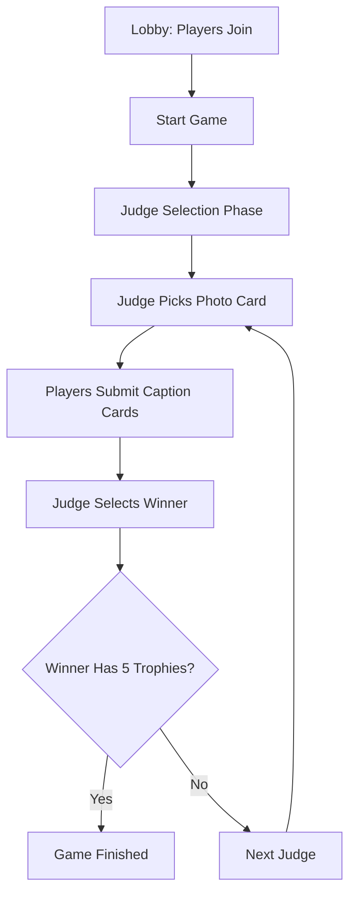

# Meme Masters - Design Document

## Project Overview

**Meme Masters** is a multiplayer web-based card game where players compete to create the funniest meme combinations by matching caption cards with photo cards. It's a digital adaptation of party games like "Cards Against Humanity" or "Apples to Apples" but with a focus on meme creation and humor.

### Core Concept
- **3+ players** join a game room
- One player acts as the **Judge** each round
- The Judge selects a **photo card** (meme image)
- Other players submit **caption cards** (funny text) that best match the image
- The Judge picks the funniest combination
- Winner gets a **trophy** (the photo card)
- **First to 5 trophies wins** the game

---

## Technical Architecture

### Technology Stack

#### Frontend
- **React 18** - Modern UI library with hooks
- **TypeScript** - Type safety and better developer experience
- **Vite** - Fast build tool and development server
- **Tailwind CSS** - Utility-first CSS framework
- **Radix UI** - Accessible component primitives
- **Wouter** - Lightweight client-side routing
- **TanStack Query** - Server state management
- **Framer Motion** - Animation library

#### Backend
- **Node.js** - JavaScript runtime
- **Express.js** - Web application framework
- **WebSocket (ws)** - Real-time bidirectional communication
- **TypeScript** - Shared type definitions
- **Drizzle ORM** - Type-safe database operations
- **PostgreSQL** - Primary database (via Neon/Supabase)

#### Infrastructure
- **Replit** - Development and hosting platform
- **Supabase** - Database and file storage
- **In-Memory Storage** - Fallback for development

### Architecture Patterns

#### 1. **Monorepo Structure**
```
memematch/
├── client/           # React frontend
├── server/           # Express backend
├── shared/           # Shared types and schemas
└── attached_assets/  # Static assets
```

#### 2. **Full-Stack TypeScript**
- Shared type definitions in `shared/schema.ts`
- End-to-end type safety from database to UI
- Zod schemas for runtime validation

#### 3. **Real-time Communication**
- WebSocket connections for instant game updates
- Event-driven architecture with message types
- Automatic reconnection and message queuing

#### 4. **Component-Based UI**
- Reusable UI components in `components/ui/`
- Game-specific components in `components/game/`
- Custom hooks for state management

---

## Data Models

### Core Entities

#### Users
```typescript
interface User {
  id: string;
  username: string;
  password: string; // Hashed
}
```

#### Rooms
```typescript
interface Room {
  id: string;
  code: string;        // 6-character game code
  hostId: string;      // Room creator
  status: "waiting" | "selecting_judge" | "playing" | "finished";
  currentJudgeId?: string;
  currentRound: number;
  selectedPhotoCard?: PhotoCard;
  submittedCards: SubmittedCard[];
  createdAt: Date;
}
```

#### Players
```typescript
interface Player {
  id: string;
  roomId: string;
  name: string;
  isOnline: boolean;
  hand: CaptionCard[];     // Player's caption cards
  trophies: number;        // Won photo cards
  numberCard?: number;     // For judge selection
  hasSubmittedCard: boolean;
  hasExchangedCard: boolean;
  joinedAt: Date;
}
```

#### Cards
```typescript
interface Card {
  id: string;
  type: "caption" | "photo";
  content: string;
  imageUrl?: string;       // For photo cards
  description?: string;    // Alt text for images
}
```

#### Game Decks
```typescript
interface GameDeck {
  id: string;
  roomId: string;
  captionDeck: CaptionCard[];  // Available caption cards
  photoDeck: PhotoCard[];      // Available photo cards
  discardPile: Card[];         // Used cards
}
```

---

## Game Flow & State Management

### Game States

1. **Waiting** - Players joining the lobby
2. **Selecting Judge** - Number card reveal phase
3. **Playing** - Active gameplay (photo selection, caption submission, judging)
4. **Finished** - Game completed, winner announced

### Round Flow



### WebSocket Events

#### Client → Server
- `join_room` - Connect player to game room
- `start_game` - Host initiates judge selection
- `reveal_number_card` - Show player's number for judge selection
- `start_round` - Begin gameplay after judge selection
- `select_photo_card` - Judge chooses meme image
- `submit_caption_card` - Player submits caption
- `exchange_card` - Player swaps one card (once per round)
- `select_winner` - Judge picks winning caption
- `restart_game` - Reset game state

#### Server → Client
- `game_state` - Full game state update
- `player_joined` - New player notification
- `judge_selection_started` - Begin number card phase
- `number_card_revealed` - Player revealed their number
- `round_started` - Gameplay phase begins
- `photo_card_selected` - Judge chose photo
- `card_submitted` - Player submitted caption
- `card_exchanged` - Player swapped card
- `round_winner_selected` - Round completed
- `game_finished` - Game over
- `game_restarted` - Game reset
- `player_disconnected` - Player left
- `error` - Error message

---

## User Interface Design

### Page Structure

#### 1. **Home Page** (`/`)
- Player name input
- Create room or join with code
- Game rules modal
- Responsive design with gradient background

#### 2. **Lobby Page** (`/lobby/:code`)
- Room code display with copy functionality
- Player list with online status and trophy counts
- Host controls (start game button)
- Real-time player updates

#### 3. **Game Page** (`/game/:code`)
- **Judge Selection Phase**: Number card reveal animation
- **Gameplay Phase**: 
  - Photo card selection (judge only)
  - Caption card hand management
  - Card submission interface
  - Winner selection (judge only)
- **Game End**: Winner celebration and restart options

### Key UI Components

#### Game Components
- `JudgeSelection` - Animated number card reveal
- `GamePlay` - Main gameplay interface
- `GameEnd` - Winner announcement
- `WinnerAnnouncement` - Round winner celebration
- `RulesModal` - Game instructions

#### UI Components (Radix-based)
- Form controls (Button, Input, Card)
- Layout components (Dialog, Tabs, Accordion)
- Feedback components (Toast, Alert)
- Navigation components (Breadcrumb, Pagination)

### Design System

#### Colors & Themes
- **Primary**: Blue gradient (`from-primary via-accent to-secondary`)
- **Dark mode support** via Tailwind CSS
- **Semantic colors** for game states (success, warning, error)

#### Typography
- **Headings**: Bold, large fonts for impact
- **Body**: Readable sans-serif
- **Monospace**: Room codes and technical info

#### Animations
- **Card flips** for number reveal
- **Fade transitions** between game states
- **Bounce animations** for celebrations
- **Loading spinners** for async operations

---

## Real-time Features

### WebSocket Implementation

#### Connection Management
- **Automatic reconnection** with exponential backoff
- **Message queuing** during disconnection
- **Connection status** indicators
- **Graceful degradation** on connection loss

#### State Synchronization
- **Broadcast updates** to all room participants
- **Optimistic updates** for better UX
- **Conflict resolution** for simultaneous actions
- **Player presence** tracking

#### Performance Optimizations
- **Message deduplication** to prevent duplicate processing
- **Selective updates** - only send changed data
- **Connection pooling** for multiple rooms
- **Memory cleanup** on disconnect

---

## Data Storage Strategy

### Development Storage (In-Memory)
- **MemStorage class** implements all storage interfaces
- **Pre-loaded card content**:
  - **230 caption cards** with humorous text
  - **75 photo cards** with meme-worthy images
- **Fallback Unsplash images** if Supabase unavailable
- **Session persistence** via localStorage

### Production Storage (PostgreSQL)
- **Drizzle ORM** for type-safe database operations
- **Neon/Supabase** for hosted PostgreSQL
- **Connection pooling** for performance
- **Migration system** for schema updates

### Image Management
- **Supabase Storage** for custom meme images
- **Unsplash API** for fallback images
- **CDN optimization** for fast loading
- **Image preprocessing** for consistent sizing

---

## Security & Performance

### Security Measures
- **Input validation** with Zod schemas
- **XSS prevention** via React's built-in protections
- **Rate limiting** on WebSocket messages
- **Room code generation** with cryptographic randomness
- **Session management** with secure tokens

### Performance Optimizations
- **Code splitting** with dynamic imports
- **Image optimization** with responsive loading
- **Caching strategies** for static assets
- **Bundle optimization** with Vite
- **Memory management** for long-running games

### Error Handling
- **Global error boundaries** in React
- **WebSocket error recovery** with reconnection
- **Graceful degradation** for network issues
- **User-friendly error messages**
- **Logging and monitoring** for debugging

---

## Deployment & DevOps

### Replit Integration
- **Single-port deployment** (frontend + backend)
- **Environment variables** for configuration
- **Hot reloading** in development
- **Production builds** with optimization

### Build Process
- **Vite bundling** for frontend
- **ESBuild compilation** for backend
- **TypeScript compilation** with strict checks
- **Asset optimization** and minification

### Environment Configuration
- **Development**: Local in-memory storage
- **Production**: PostgreSQL + Supabase
- **Environment detection** for appropriate configs
- **Secrets management** via environment variables

---

## Future Enhancements

### Gameplay Features
- **Custom card creation** by players
- **Tournament mode** with brackets
- **Team play** options
- **Spectator mode** for non-players
- **Replay system** for memorable rounds

### Technical Improvements
- **Mobile app** with React Native
- **Voice chat integration**
- **Advanced animations** with better libraries
- **Performance analytics** and monitoring
- **Automated testing** suite

### Social Features
- **Player profiles** and statistics
- **Friend systems** and private lobbies
- **Leaderboards** and achievements
- **Social media sharing** of funny combinations
- **Community card submissions**

---

## Conclusion

Meme Masters is a well-architected multiplayer web game that combines modern web technologies with engaging gameplay. The real-time WebSocket communication, type-safe full-stack TypeScript implementation, and responsive UI design create a seamless gaming experience. The modular architecture allows for easy feature additions and maintenance, while the robust error handling and performance optimizations ensure reliability at scale.

The game successfully captures the fun and social aspects of party card games in a digital format, with the added benefits of automated game management, instant setup, and remote play capabilities. 